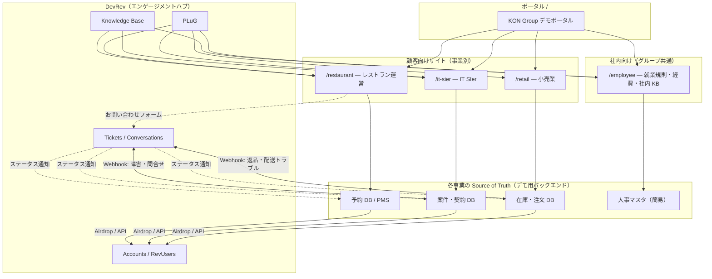

# KON Group サンプルサイト — 設計方針（唯一の参照ドキュメント）

> **このファイルが本リポジトリの唯一の設計方針です。**  
> 構成・連携・デプロイに関する判断はすべてここに記録し、方針が変わったら本ドキュメントを更新してください。  
> 実装の詳細メモは各サイト配下の `docs/` に置きますが、方針の正は常に本ファイルです。

| 項目 | 値 |
|------|-----|
| 最終更新 | 2026-07-02 |
| ステータス | Phase 1 完了（`/employee/` 本実装済） |
| リポジトリ | [konchangakita/devrev-samplesite](https://github.com/konchangakita/devrev-samplesite) |

---

## 1. 目的

架空の **KON グループ**（複数事業を持つ企業）を題材に、DevRev の導入パターンをデモできるサンプルサイト群を提供する。

- Webinar・営業デモ・PLuG / KB / CRM / Ticket 連携の検証
- **「業務データの正は顧客システム、DevRev は顧客接点・サポート・CRM・ナレッジのハブ」** というベストプラクティスを体現する
- サイトは今後増える前提。拡張しやすいモノレポ構成とする

---

## 2. 基本方針（不変原則）

| # | 原則 | 説明 |
|---|------|------|
| P1 | **モノレポ** | 複数サンプルサイトを 1 つの Git リポジトリで管理する |
| P2 | **SoT は業種システム** | 予約・在庫・案件などトランザクションデータの正は各業種のバックエンド（PMS / POS / PSA 等） |
| P3 | **DevRev はエンゲージメントハブ** | Ticket・会話・CRM・KB・PLuG は DevRev が担う。予約 CRUD 等を DevRev で編集しない |
| P4 | **社内サイトはグループ共通** | 就業規則・経費精算など従業員向けは事業横断の 1 サイト |
| P5 | **ポータルに PLuG なし** | 最上位 TOP はサイト一覧のみ。SDK は各サブサイトに設置 |
| P6 | **段階的実装** | Phase 1 で動く最小構成 → Phase 2 で Webhook 連携 → Phase 3 で Airdrop 等の本番近似 |

---

## 3. システム構成

### 3.1 全体像



### 3.2 DevRev 連携モデル

```
┌─────────────────┐                              ┌──────────────────┐
│  PMS / 予約 DB   │  ──顧客マスタ同期──────────→  │     DevRev        │
│  (Source of Truth)│     (Airdrop / API)          │                  │
│                  │                              │  ・RevUser/Account│
│  ・予約 CRUD     │  （予約自体は PMS 内で完結）   │  ・Ticket / 会話  │
│  ・空室・料金    │                              │  ・KB             │
│                  │  ←─問い合わせ・障害等────────  │  ・PLuG           │
│                  │     (Webhook / PLuG)          │                  │
└─────────────────┘                              └──────────────────┘
```

| 連携方式 | 用途 |
|----------|------|
| **Airdrop / API** | 顧客・取引先マスタ（Account / RevUser）の同期 |
| **Webhook** | お問い合わせ・障害・返品トラブルなど **サポート対象** のイベント通知（予約 CRUD 自体は Ticket 化しない） |
| **PLuG** | リアルタイムの顧客・社員接点（DB 同期とは別レイヤー） |
| **KB API** | FAQ・社内ポリシー記事の参照（社内 KB の SoT は DevRev） |

### 3.3 データの正（SoT）の切り分け

| データ | Source of Truth | DevRev の役割 |
|--------|-----------------|---------------|
| 予約・空室・料金 | PMS / 予約 DB | **予約は PMS 内で完結**。DevRev は問い合わせ Ticket・顧客 CRM・FAQ KB |
| 案件・SLA・契約 | PSA / サービス DB | インシデント、エスカレーション、顧客 CRM |
| 注文・在庫・返品 | POS / EC バックエンド | サポート Ticket、会員 CRM |
| 就業規則・経費ルール | **DevRev KB** | 社内検索・社員向け PLuG |
| 会話・対応履歴 | **DevRev** | Ticket / Conversation が正 |
| 顧客・取引先マスタ | 各事業 DB → DevRev CRM に同期 | Account / RevUser として参照 |

---

## 4. サイト一覧

| パス | 名称 | 対象 | 状態 | PLuG |
|------|------|------|------|------|
| `/` | KON Group ポータル | デモ閲覧者 | ✅ 実装済 | なし |
| `/restaurant/` | レストラン予約サイト | エンドユーザー（来店客） | ✅ 実装済（`sites/restaurant`） | 顧客向け app_id |
| `/employee/` | 社内ヘルプサイト | KON グループ従業員 | ✅ 実装済（`sites/employee`） | 社員向け app_id（Phase 1） |
| `/it-sier/` | IT SIer サービスサイト | エンドユーザー（顧客企業） | 📋 未実装（ポータルに Coming soon 可） | 顧客向け app_id |
| `/retail/` | 小売 EC / 店舗サイト | エンドユーザー（購買者） | 📋 未実装（ポータルに Coming soon 可） | 顧客向け app_id |

**社内サイト（`/employee/`）は事業横断で共通。** 事業固有の社内手順は KB のカテゴリ・タグでフィルタする。

### 4.1 各サイトの概要

#### `/restaurant/` — レストラン運営（顧客向け）

- 会員登録・ログイン、オンライン予約、マイ予約、お問い合わせ、管理者画面
- SoT: 予約 DB（現行 SQLite デモ）
- 実装: `sites/restaurant/`

#### `/employee/` — 社内ヘルプ（グループ共通）

- 就業規則・経費精算ガイドの閲覧・検索
- 社員ログイン（デモ用簡易アカウント）
- SoT: DevRev KB（Phase 1 は静的 Markdown でも可）
- 記事で解決しない場合 → 社員向け PLuG で問い合わせ

#### `/it-sier/` — IT SIer（顧客向け）※将来

- サービス一覧、障害報告、契約問い合わせ
- SoT: 案件・契約 DB（PSA）

#### `/retail/` — 小売（顧客向け）※将来

- 商品閲覧、注文、返品問い合わせ
- SoT: 在庫・注文 DB（POS）

---

## 5. リポジトリ構成（目標）

```
devrev-samplesite/
├── docs/
│   └── DESIGN.md              ← 本ファイル（唯一の設計方針）
├── README.md
├── requirements.txt
├── vercel.json
├── api/
│   └── index.py               # Vercel エントリ
│
├── portal/                    # GET /  サイト一覧
│   ├── templates/
│   └── static/
│
├── sites/
│   ├── restaurant/            # /restaurant/  （sample-helpsite から移行）
│   ├── employee/              # /employee/
│   ├── it-sier/               # /it-sier/    （将来）
│   └── retail/                # /retail/     （将来）
│
├── backends/                  # 各 SoT のデモ API（必要に応じて sites 内に同居も可）
│   ├── pms/
│   ├── psa/
│   └── pos/
│
└── shared/
    ├── devrev/                # Airdrop / Webhook 連携クライアント
    └── plug/                  # PLuG 初期化テンプレート
```

### 5.1 現状（2026-07-02）

```
devrev-samplesite/
├── app/main.py              # ルート FastAPI
├── portal/                  # GET /
├── sites/restaurant/        # /restaurant/（旧 sample-helpsite）
├── sites/employee/          # /employee/（社内ヘルプ）
├── docker-compose.yml
└── docs/DESIGN.md
```

### 5.2 FastAPI ルーティング方針

Vercel **1 プロジェクト**内でパスプレフィックスにより振り分ける。

```python
# イメージ（app/main.py）
app = FastAPI()
app.include_router(portal_router)              # GET /
app.mount("/restaurant", restaurant_app)
app.mount("/employee", employee_app)
# app.mount("/it-sier", it_sier_app)           # 将来
# app.mount("/retail", retail_app)             # 将来
```

---

## 6. DevRev / PLuG 方針

| 項目 | 方針 |
|------|------|
| PLuG 設置場所 | 各サブサイトの `base.html` 相当。ポータルには設置しない |
| app_id（現行） | **1 DevRev 組織 = PLuG app_id 1 つ**（製品制約）。ルート `.env` の `DEVREV_PLUG_APP_ID` を全サイトで共有 |
| app_id（将来） | マルチ PLuG リリース後はサイト別 app_id を推奨（§6.2・`docs/future-multi-plug.md`） |
| 顧客サイト | 会員ログイン時 `auth-tokens.create` で RevUser セッション連携（既存パターン） |
| 社員サイト | 社員 ID・部署を `addSessionProperties` で付与 |
| Session properties 例 | 顧客: `demo_source`, `user_ip` / 社員: `department`, `employee_id`, `site=employee` |
| 接続設定の正 | **リポジトリルートの `.env`**（§6.1 参照）。Vercel 環境変数は公開デプロイ用の写し |

### 6.1 DevRev 認証情報の運用（接続設定）

PLuG **app ID** と **Public Application Access Token（AAT）** など、DevRev 接続に必要な秘密情報は **Git に含めず、環境ごとの `.env` で管理する**。ブラウザ上の管理画面での動的更新は採用しない（将来も必須ではない）。

#### 基本方針

| 項目 | 方針 |
|------|------|
| **接続設定（共通）** | リポジトリルートの **`.env`** に `DATABASE_URL`・`DEVREV_*` 等を一括設定 |
| **テンプレート** | ルート `.env.example` のみ |
| **Vercel** | 公開 URL 用。ルート `.env` の値を環境変数に写す |
| **チーム共有** | 実トークンは 1Password 等で配布。Slack 等への平文投稿はしない |
| **AAT** | **サーバー専用**。ブラウザ・HTML に露出させない |

#### 環境変数ファイルの役割分担

```
devrev-samplesite/
└── .env                 ← DATABASE_URL / DEVREV_* / SECRET_KEY など全サイト共通
```

Vercel には `.env` はデプロイされないため、**同じキー名**で Environment Variables に写す。

#### なぜルート `.env` に集約するか

1. **Vercel とローカルで同じ一覧** — サイトごとに env を分けず、1 か所を写すだけ
2. **Vercel に入れないメンバー**でも `docker compose up` で開発・デモできる
3. **リポジトリをコピー／fork した人**が、自分の DevRev org の値だけ差し替えて独立環境を作れる
4. `git pull` しても `.env` は上書きされず、接続先とコードを分離できる

#### リポジトリをコピーして使う人の手順

```
1. clone / fork
2. .env.example → .env（ルート）に DATABASE_URL・DEVREV_* 等を設定
3. リポジトリルートで docker compose up --build
4. （任意）Vercel に同じ環境変数を設定
```

#### 環境ごとの役割分担

```
開発メンバー全員
  └─ ルート .env（DATABASE_URL + DEVREV_* + SECRET_KEY）

Vercel にアクセスできる 1〜2 人
  └─ 公開デモ URL 用に Vercel 環境変数へ同内容を設定

リポジトリをコピーした外部／別チーム
  └─ .env.example + 自 Neon / DevRev テナントで完結
```

#### サイトごとの app_id について（現行）

**現行:** DevRev 組織あたり PLuG app_id は **1 つのみ**（マルチ PLuG チャット未リリース）。そのため `DEVREV_PLUG_APP_ID` / AAT はルート `.env` で全サイト共有とする。

**将来:** マルチ PLuG 対応後は顧客向け・社員向けなど **サイト別 app_id** に分離する。拡張手順・予約 env 名は **§6.2** と `docs/future-multi-plug.md` を参照。

#### サイト追加時

新規サイト `sites/<name>/` を足すときも **ルート `.env` をそのまま共有**する。サイト固有の `.env.example` は置かない。

#### 主要な環境変数

| 変数 | 置き場所 | 用途 |
|------|----------|------|
| `DATABASE_URL` | **ルート `.env`** | Neon（PostgreSQL）。未設定時は SQLite |
| `SECRET_KEY` | **ルート `.env`** | セッション署名 |
| `DEVREV_PLUG_APP_ID` | **ルート `.env`** | PLuG app ID |
| `DEVREV_APPLICATION_ACCESS_TOKEN` | **ルート `.env`** | 会員 PLuG 連携 |
| `DEVREV_PAT` | **ルート `.env`** | `conversations.update` 等 |

#### 採用しない方式（現時点）

| 方式 | 見送り理由 |
|------|------------|
| ブラウザ上の設定画面で AAT を保存 | 実装コスト・漏洩リスク。`.env` で十分 |
| URL クエリで app ID 上書き | 必要になったら Phase 2 以降で検討可。現時点は必須ではない |
| 認証情報を Git にコミット | 秘密の漏洩リスク |

### 6.2 マルチ PLuG への拡張（将来）

| 項目 | 内容 |
|------|------|
| **トリガー** | DevRev の **マルチ PLuG チャット**機能の一般提供 |
| **目的** | サイトごとに PLuG app_id・AAT を分け、会話・Session replay・設定の混在を防ぐ |
| **詳細手順** | [`docs/future-multi-plug.md`](future-multi-plug.md) |
| **コード準備** | `shared/devrev/plug_env.py` の `resolve_site_env()`（サイト別 `__` キー → 共通キーへフォールバック） |
| **予約 env 例** | `DEVREV_PLUG_APP_ID__restaurant`, `DEVREV_PLUG_APP_ID__employee` |
| **Phase** | Phase 2 以降（製品リリース後に着手） |

現行ではサイト別キーを **設定しなければ** 共通 `DEVREV_PLUG_APP_ID` のみが使われ、挙動は変わらない。

---

## 7. デプロイ方針

| 項目 | 決定 |
|------|------|
| ホスティング | **Vercel**（1 プロジェクト） |
| Git | **モノレポ**（本リポジトリ） |
| URL | パスベース（`/restaurant/`, `/employee/` 等）。サブドメインは使わない |
| DB（SoT） | **Neon（PostgreSQL）** — レストラン PMS。`DATABASE_URL` 未設定時は SQLite フォールバック |
| 環境変数 | **ルート `.env`**（`DATABASE_URL` + `DEVREV_*`）。Vercel は同値を写す |

### 7.1 インフラの 1:1 対応（Vercel × Neon）

**1 つのデモ環境**は、次の 1:1:1 で構成する。

```
Git リポジトリ（devrev-samplesite） 1つ
  └─ Vercel プロジェクト 1つ          … モノレポ全体をデプロイ（ポータル + 全サイト）
       └─ Neon プロジェクト 1つ        … 業務データの SoT（PMS / 予約 DB）
```

| 対応 | 方針 |
|------|------|
| **Git : Vercel** | **1 : 1**（リポジトリを Vercel に接続） |
| **Vercel : Neon** | **1 : 1**（1 デプロイ環境に 1 Neon プロジェクト） |
| **Vercel : サイト数** | **1 : 多**（`/restaurant/`, `/employee/` 等は同一 Vercel 内でパス振り分け） |
| **Neon : サイト数** | **当面 1 DB 内でテーブル（または schema）管理**。サイトごとに Neon プロジェクトは分けない |

#### なぜ Vercel と Neon を 1:1 にするか

1. **環境の境界が明確** — 「この URL の裏にある DB」が一意に決まる
2. **`.env` と Vercel 環境変数の対応が素直** — `DATABASE_URL` をローカルと Vercel で同じキー名で写せる（§6.1）
3. **リポジトリをコピーした人**が、自分用に **Vercel 1個 + Neon 1個 + `.env`** で独立環境を再現しやすい
4. **デモストーリー** — Neon = 外部 PMS（SoT）、Vercel = その上のアプリ群、DevRev = 別 SaaS ハブ

#### リポジトリをコピーして使う人のインフラ手順

```
1. fork / clone
2. Neon でプロジェクト作成 → `DATABASE_URL` を取得
3. リポジトリルート `.env` に `DATABASE_URL`・`DEVREV_*` 等を設定
4. ローカル: docker compose up（または uvicorn）
5. （任意）Vercel でプロジェクト作成 → 同リポジトリを接続 → 同じ環境変数を設定
```

#### Neon の中身（レストラン PMS・移行予定）

| テーブル | 役割 | 状態 |
|----------|------|------|
| `users` | 会員・管理者 | ✅ Postgres / SQLite 対応 |
| `reservations` | 予約（SoT） | ✅ Postgres / SQLite 対応 |
| `demo_invite_tokens` | デモアクセスゲート用招待トークン | ✅ Postgres / SQLite 対応 |

### 7.2 デモアクセスゲート（招待リンク + クッキー）

デモ URL を知った一般ユーザーが、**招待なしに再アクセスできない**ようにする。会員ログイン・社員ログインとは **別レイヤー**（サイトに入れるかどうかだけを制御）。

#### 目的

| 層 | 制御対象 | 例 |
|----|----------|-----|
| **デモゲート**（本節） | デモメンバーだけがサイト全体にアクセスできるか | 招待リンクを持つ人のみ |
| サイト内ログイン | 各サイトのデモ用ユーザー | レストラン会員、社員ログイン |

#### フロー

```
1. 運用者が Agent に依頼 → DB に招待トークンを発行
2. 招待 URL を配布（例: https://<host>/?invite=<token>）
3. 初回アクセス: クエリの token を DB で検証 → 通過なら HttpOnly クッキーを設定 → リダイレクト（クエリ除去）
4. 以降: クッキーが有効なら全パス（/ , /restaurant/* , /employee/*）にアクセス可
5. URL だけ記憶したユーザー: クッキーなし → 403 またはゲート画面
```

#### 再アクセス（同一デバイス）

招待リンクで **一度通過したブラウザ** には HttpOnly クッキーが残る。以降は `https://<host>/restaurant/` など **直接 URL でアクセス可**（招待パラメータ不要）。

| 状況 | 結果 |
|------|------|
| 同じブラウザ・クッキーあり | ✅ 直接 URL で可 |
| 別ブラウザ・別デバイス | ❌ 再度招待リンクが必要 |
| クッキー削除・シークレットモード | ❌ 再度招待リンクが必要 |
| URL だけ知っている（未招待） | ❌ ブロック |
| 紐づく招待トークンが無効化された | ❌ ブロック（毎リクエスト DB で検証） |

#### トークン管理（Agent 運用）

| 操作 | 方法 |
|------|------|
| **発行** | Agent に依頼 → DB にレコード作成 → 招待 URL を返す |
| **一覧・再表示** | Agent に依頼 → DB から有効トークンと URL を表示 |
| **無効化** | 流失を感じたら Agent に依頼 → `revoked_at` を設定 |
| **再発行** | 旧トークン無効化 + 新トークン発行（Agent 依頼） |

- **有効期限は設けない**（期限切れなし）
- **管理 UI は作らない** — 発行・無効化・再表示はすべて Agent（Cursor）経由で DB を操作
- トークンは **Neon / SQLite**（`DATABASE_URL` 共有）の `demo_invite_tokens` テーブルに保存

#### テーブル（案）

| カラム | 用途 |
|--------|------|
| `id` | PK |
| `token` | 招待用ランダム文字列（ユニーク） |
| `label` | 用途メモ（例: `webinar-2026-07`） |
| `revoked_at` | 無効化日時（NULL = 有効） |
| `created_at` | 発行日時 |
| `last_used_at` | 最終利用（任意） |

#### 実装方針

| 項目 | 方針 |
|------|------|
| ミドルウェア | ルート `app/main.py` で全マウントの前に適用 |
| 除外パス | `/health`（ヘルスチェック） |
| **Vercel** | **追加の環境変数は不要**。`VERCEL=1`（プラットフォーム自動）でゲート ON |
| 招待 URL | `VERCEL_URL` から自動生成。管理スクリプトは `--base-url` で上書き可 |
| ローカル開発 | 既定 OFF。試すときだけ `.env` に `DEMO_GATE_ENABLED=true` |

#### 採用しない方式

| 方式 | 見送り理由 |
|------|------------|
| ブラウザ上のトークン管理 UI | Agent 運用で十分。実装コスト不要 |
| トークン有効期限 | 運用方針として不要。無効化・再発行で対応 |
| 会員／社員ログインと統合 | 別管理。ゲートはデモ入口のみ |

将来 it-sier / retail が DB を持つ場合は、**まず同一 Neon 内で schema 分離**を検討する。足りなければ Neon プロジェクト分割。

#### Preview 環境

- 初期は **Production（main）= Neon 本番ブランチ 1 本**で十分
- PR Preview 用に DB を分けたくなったら、Neon の **branch** 機能を検討（Phase 2 以降）

#### 採用しない構成（現時点）

| 構成 | 見送り理由 |
|------|------------|
| サイトごとに Vercel プロジェクト | パス振り分けで足りる。env・DNS が増える |
| サイトごとに Neon プロジェクト | 現規模では過剰。schema / テーブル分けで十分 |
| SQLite のまま Vercel 公開 | Serverless で永続化できない |

> **注意:** FastAPI + セッションは Vercel Serverless 向けに `api/index.py`（Mangum）でデプロイする。Neon の `DATABASE_URL` と DevRev 変数を Vercel 環境変数に設定すること。

---

## 8. 実装フェーズ

### Phase 0 — 方針確定・基盤構築（完了）

- [x] モノレポ方針
- [x] KON グループ・多事業 + 共通社内サイト構成
- [x] SoT / DevRev ハブモデル
- [x] 本ドキュメント作成
- [x] `sample-helpsite` → `sites/restaurant/` への移行
- [x] ポータル TOP 作成（`portal/`）
- [x] ルート `app/main.py` で `/restaurant` マウント
- [x] ルート Docker Compose

### Phase 1 — 最小デモ（完了）

| 対象 | スコープ | 状態 |
|------|----------|------|
| `/restaurant/` | パスプレフィックス移行 | ✅ 完了 |
| `/employee/` | 静的記事 + 簡易検索 + 社員 PLuG | ✅ 完了 |
| `/` | サイトリンクカード | ✅ 完了 |
| DevRev 連携 | PLuG + `user_ref` | ✅ レストランで既存動作 |
| その他事業 | ポータルに「Coming soon」 | ✅ 完了 |
| Neon（PMS SoT） | `users` + `reservations` を Postgres 化 | ✅ 実装済（`DATABASE_URL`） |
| Vercel 公開 | `api/index.py` + Mangum、環境変数は Vercel に写す | ✅ デプロイ済 |

### Phase 2 — 連携デモ強化

- [x] **デモアクセスゲート**（§7.2）— 招待トークン DB + ミドルウェア + `scripts/manage_invite_tokens.py`
- **お問い合わせ**（`/restaurant/contact` 等）→ Webhook → DevRev Ticket 起票（模擬 or 実 API）
- PLuG 会話・障害報告（it-sier 想定）→ Ticket 連携
- DevRev 側対応 → ステータス通知 → 業務システム反映（該当サイトのみ）
- **（将来）** `/employee/` の社内 KB を DevRev Web Crawler Job API で取り込み（現行は静的 Markdown で十分）
- **（DevRev マルチ PLuG リリース後）** サイト別 PLuG app_id / AAT への移行（`docs/future-multi-plug.md`）

> **予約と Ticket の切り分け:** オンライン予約の作成・変更・キャンセルは PMS（予約 DB）だけで完結する。Ticket は「問い合わせ」「障害」「返品トラブル」などサポートが必要な事象に限る（§3.3・P3）。

### Phase 3 — 本番近似

- Airdrop で Account / Contact 同期
- カスタムオブジェクトで予約 ID・注文番号を DevRev 側に参照キーとして保持
- Snap-in による双方向同期
- `/it-sier/`, `/retail/` の実装

---

## 9. 新規サイト追加ルール

新しいサンプルサイトを足すときは、実装前に以下を本ドキュメントの **§4 サイト一覧** と **§10 決定ログ** に追記する。

1. **パス**（例: `/logistics/`）
2. **事業名・対象ユーザー**
3. **SoT は何か**（予約 / 案件 / 在庫 / …）
4. **DevRev に送るイベント**（Webhook 種別）
5. **PLuG app_id**（現行は組織共通 1 つ。将来は顧客向け or 社員向けで分離 — §6.2）
6. **KB スペース**（顧客 FAQ or 社内ポリシー）
7. **Phase**（いつ実装するか）

---

## 10. 決定ログ

方針が決まるたびに、日付・決定内容・理由を追記する。

| 日付 | 決定 | 理由・メモ |
|------|------|------------|
| 2026-07-01 | モノレポ（1 Git リポジトリ）で複数サイトを管理 | 共通 PLuG / DevRev 連携の横展開が容易。現規模ではポリレポの管理コストが不要 |
| 2026-07-01 | Vercel 1 プロジェクト、パスベース振り分け | 管理の簡素化。サブドメインは DNS 設定が増えるため見送り |
| 2026-07-01 | 架空「KON グループ」で多事業（レストラン / IT SIer / 小売）を統一 | デモストーリーの一貫性。DevRev のマルチユースケース訴求 |
| 2026-07-01 | 社内従業員サイトは事業横断で 1 つ（`/employee/`） | 現実のグループ人事・経理・IT ポリシーと同型 |
| 2026-07-01 | トランザクションデータの SoT は各業種 DB、DevRev はハブ | DevRev ベストプラクティス（Airdrop / Webhook モデル） |
| 2026-07-01 | Phase 1 は restaurant + employee のみ実装 | 段階的に複雑さを抑える。it-sier / retail は Coming soon |
| 2026-07-01 | ポータル TOP に PLuG は設置しない | 各サイトの SDK デモに集中。初見の迷い防止 |
| 2026-07-01 | 本ファイルを唯一の設計方針ドキュメントとする | 今後の開発判断の単一参照点 |
| 2026-07-01 | `.cursor/rules/design.mdc` を追加（`alwaysApply: true`） | 別セッションでも Agent が DESIGN.md を参照するため |
| 2026-07-01 | `sample-helpsite` → `sites/restaurant/`、ポータル・ルートアプリ追加 | Phase 0 完了。`/restaurant/` マウント、`url_prefix` 対応 |
| 2026-07-01 | DevRev 接続設定は各サイトの `.env` を正とする | Vercel 非アクセスメンバー・リポジトリコピー時の独立性。Vercel は公開デモ用の写し |
| 2026-07-01 | Vercel 1プロジェクト : Neon 1プロジェクト = 1:1 | デモ環境の境界を明確化。モノレポ内の複数サイトは同一 Vercel に同居。Neon は PMS SoT |
| 2026-07-01 | Neon Auth は有効にしない | 認証はアプリ `users` + DevRev PLuG。Neon は Postgres のみ利用 |
| 2026-07-01 | `DATABASE_URL` で Neon 接続、`reservations` を DB 化 | PMS SoT。未設定時 SQLite フォールバック |
| 2026-07-01 | `DATABASE_URL` はリポジトリルート `.env` に一括設定 | サイトごとの DB 切り替えは不要。DevRev はサイト `.env` のまま |
| 2026-07-01 | `api/index.py` + `vercel.json` で Vercel Serverless 対応 | FastAPI を Mangum でラップ。環境変数は Vercel に写す |
| 2026-07-01 | DevRev 設定もルート `.env` に集約 | サイト別 env と Vercel 二重管理を廃止。デモは全サイト共通の app_id / AAT |
| 2026-07-01 | 現行は 1 組織 1 PLuG app_id を全サイト共有 | DevRev 製品制約。マルチ PLuG 後に §6.2 でサイト別へ拡張予定 |
| 2026-07-01 | `shared/devrev/plug_env.py` と `docs/future-multi-plug.md` を追加 | マルチ PLuG リリース時の env 命名・移行手順を事前記録 |
| 2026-07-02 | `sites/employee/` で `/employee/` 本実装 | Phase 1 完了。静的 Markdown 記事・検索・社員ログイン・PLuG session properties |
| 2026-07-02 | 予約 CRUD は Ticket 化しない | 予約は PMS で完結。Ticket は問い合わせ・障害等のサポート事象のみ。図・Phase 2 の誤記を修正 |
| 2026-07-02 | 社内 KB は将来 Web Crawler Job で取り込み | KB API 直読みではなく Crawler Job API で `/employee/` をクロールする方針（Phase 2 以降・未着手） |
| 2026-07-02 | デモサイトは招待リンク＋クッキーでゲート | URL を記憶した一般ユーザーはアクセス不可。次の実装候補 |
| 2026-07-02 | 招待トークンは Agent が DB に発行・無効化・再表示 | 管理 UI 不要。有効期限なし。流失時は無効化＋再発行 |
| 2026-07-02 | デモゲートと会員／社員ログインは別管理 | ゲートはデモメンバーがサイトに入れるかだけ。サイト内認証とは独立 |
| 2026-07-02 | 招待通過後は同一ブラウザで直接 URL 可 | HttpOnly クッキー保持。別デバイス・クッキー削除時は再招待 |
| 2026-07-02 | デモゲート実装（`shared/gate/` + 管理スクリプト） | `demo_invite_tokens`・ミドルウェア・`scripts/manage_invite_tokens.py` |
| 2026-07-02 | Vercel ではデモゲート用 env を追加しない | `VERCEL` / `VERCEL_URL` はプラットフォーム自動。ローカルだけ任意 override |

---

## 11. 関連ドキュメント

| ファイル | 内容 | 位置づけ |
|----------|------|----------|
| `docs/DESIGN.md` | **本ファイル** | 唯一の設計方針 |
| `docs/TODO.md` | 今後のやること（軽いメモ） | 作業開始時に確認。方針確定後は DESIGN.md へ反映 |
| `docs/future-multi-plug.md` | マルチ PLuG 拡張手順（将来） | 製品リリース後のアップデート用 |
| `scripts/manage_invite_tokens.py` | デモ招待トークン発行・一覧・無効化 | Agent 運用（§7.2） |
| `.cursor/rules/design.mdc` | Cursor ルール | 本リポジトリ作業時に Agent が DESIGN.md 参照を促す（`alwaysApply: true`） |
| `sites/restaurant/docs/` | PLuG IP 同期、Snap-in メモ等 | 実装詳細（方針の正ではない） |

---

## 更新手順

1. 方針が変わったら **§10 決定ログ** に行を追加
2. 影響するセクション（§4 サイト一覧、§5 構成、§8 フェーズ等）を更新
3. ファイル先頭の **最終更新** 日付と **ステータス** を更新
4. コミットメッセージに `docs: update DESIGN.md — <要約>` と書く
