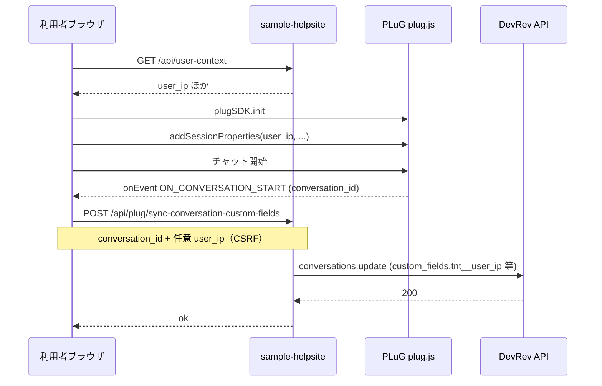

# 会話 user_ip の流れ（チャット開始 → カスタムフィールド）

チャットを開始し、その **会話 ID** の Conversation カスタムフィールドに **接続元 IP（概念として user_ip）** を載せるまでの整理です。実装は `templates/base.html`・`helpsite/main.py`・`helpsite/plug_conversation_sync.py` を参照してください。

## 用語の整理（人間の認識と API）

| レイヤー | 呼び方・キーの例 | 備考 |
|----------|------------------|------|
| 人間・説明・UI | **user_ip** | 「ユーザーの接続元 IP」という意味 |
| PLuG `addSessionProperties` | **`user_ip`** | セッション属性。Webhook や後段で参照しやすい名前 |
| `conversations.update` の `custom_fields` | **`tnt__user_ip`** など | Conversation のテナント用フィールドの **API 名**（`tnt__` 接頭辞が付くことが多い） |

**覚え方**: 概念は **user_ip**。Conversation のカスタムフィールドを **API でやり取りするとき**は、**`tnt__` を頭に付けた API 名**（例: `tnt__user_ip`）を使う。

環境変数 `DEVREV_CONVERSATION_CUSTOM_FIELD_USER_IP` は、あくまで **update の JSON に載せるキー**（既定は `tnt__user_ip`）です。`addSessionProperties` のキー名とは一致させる必要はありません。

## ゴールとなる一連の流れ

1. 利用者がサイトを開き、PLuG が初期化される。
2. サーバが推定した IP などを **`GET /api/user-context`** で返し、ブラウザが **`addSessionProperties`**（キー `user_ip` を含む）で PLuG に渡す。
3. 利用者がウィジェットでチャットを開始する。
4. PLuG が **`ON_CONVERSATION_START`** などで **`conversation_id`**（don 形式など）を通知する。
5. ブラウザが会話 ID を検知し、**PAT 等があるときはサーバ推定 IP で DevRev へ 1 回プリ同期**（カスタムフィールドが空のままにならないようにする）。設定で **IP 確定パネル**を出している場合は上書き用に表示し、変更時だけ「会話に反映」で再同期する。パネル無効時は即 **同期 API** のみ。
6. **`POST /api/plug/sync-conversation-custom-fields`** が、サーバ上で **`conversations.update`** を実行し、`custom_fields` に **API 名**（例: `tnt__user_ip`）で IP を書き込む。

## シーケンス（現在の sample-helpsite）

### PLuG 経由（ウィジェット）

### Snap-in なしの直接入力（会員ページ）

ログイン後の **`/member`** に、会話 ID と IP を手入力して **`POST /api/plug/sync-conversation-custom-fields`** を呼ぶフォームがあります（`DEVREV_PAT` 等が設定されているときのみ表示）。PLuG や `ON_CONVERSATION_START` を経由せず、**ブラウザからそのまま `conversations.update` 相当**を実行する検証用パスです。

## 環境変数（抜粋）

| 変数 | 役割 |
|------|------|
| `DEVREV_PLUG_APP_ID` | PLuG 読み込み |
| `DEVREV_PAT`（推奨）または `DEVREV_APPLICATION_ACCESS_TOKEN` | `conversations.update` 用 |
| `DEVREV_CONVERSATION_CUSTOM_FIELD_USER_IP` | update の `custom_fields` のキー（既定 `tnt__user_ip`） |
| `DEVREV_PLUG_PROMPT_USER_IP` | `true` なら会話 ID 取得後に IP 入力パネルから確定してから同期 |

詳細はリポジトリ直下の `.env.example` を参照してください。

## デバッグ

URL に **`?plug_debug=1`** を付けると、`onEvent` や `addSessionProperties`、同期 API まわりのログがコンソールに出ます。

## 今後 Snap-in を検討するとき

**詳細メモ（用語、二重書き込み、チェックリスト、トラブル時の参照ファイル）は [snap-in-development-notes.md](snap-in-development-notes.md) を参照してください。**

要点のみ:

- **`conversation.created`** 等で会話 ID を取り、**`conversations.update`** で **`tnt__user_ip`**（または組織の API 名）へ書くパターンが考えられる。
- **本サイトのブラウザ同期**と **同じ会話へ二重に書かない**よう、どちらが正か（本番は Snap-in のみ、など）を先に決める。

設計が固まったら [snap-in-development-notes.md](snap-in-development-notes.md) に **採用パターン（日付）** を追記するとよいです。
